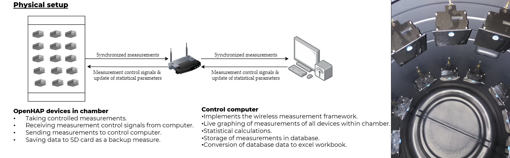

Measurement Response Normalization and Calibration

The chamber test is a low cost, rugged means to normalize the response of all OpenHAP units to a central measure.

With slight modification, the setup may be used for calibration as briefly described in commit 865ecbb

